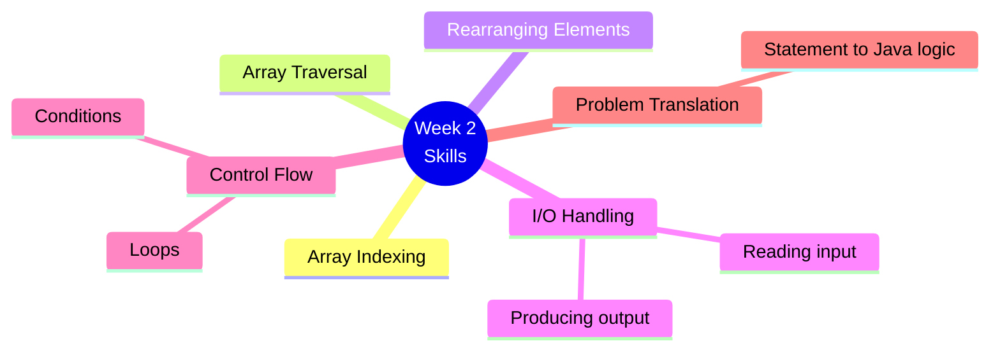
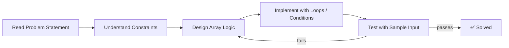
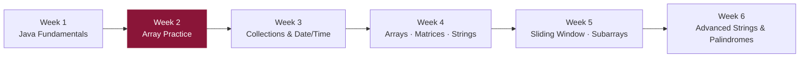

# 📘 Week 2 — Java Array Problem Solving

> Continued Java problem solving with array manipulation and logical problem-solving tasks.

---

## 🗂️ Problems / Tasks

| # | Task | Focus |
|---|---|---|
| 1 | Shuffle the Array | Array rearrangement |
| 2 | Task 2 | Array logic |
| 3 | Task 3 | Array logic |
| 4 | Task 4 | Array logic |
| 5 | Task 5 | Array logic |
| 6 | Task 6 | Array logic |
| 7 | Task 7 | Array logic |
| 8 | Task 8 | Array logic |
| 9 | Task 9 | Array logic |
| 10 | Task 10 | Array logic |

> ℹ️ **Note:** Some tasks use generic names in the source repository — this README keeps those names unchanged to match the repo.

---

## 🧠 Skills Practiced

---

## 🔗 Workflow: Statement → Solution

---

## 🎯 Learning Goal

Improve **speed and accuracy** with array-based problems, and strengthen the ability to convert a **problem statement into working Java logic**.

---

## 📈 Where This Fits in the Journey

